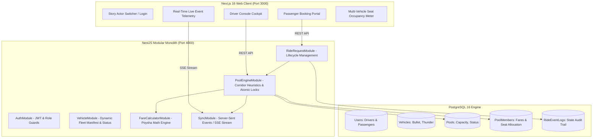
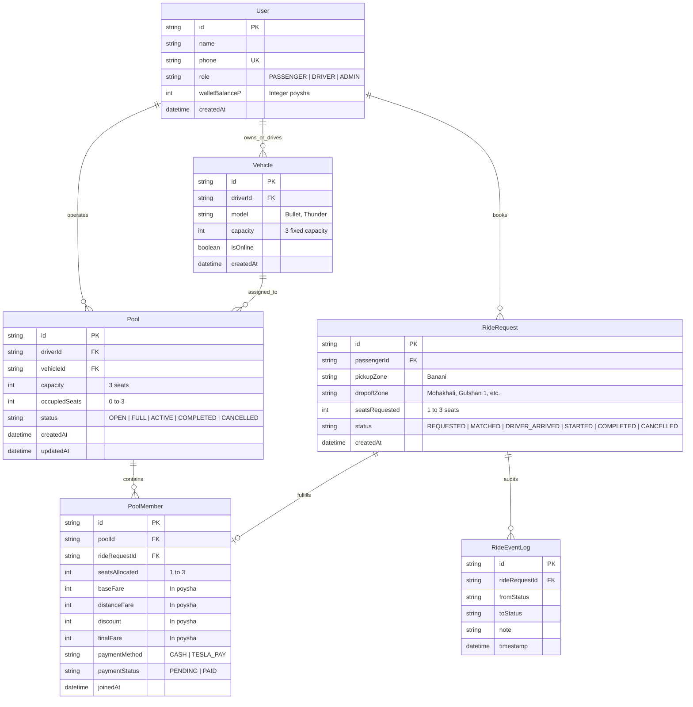
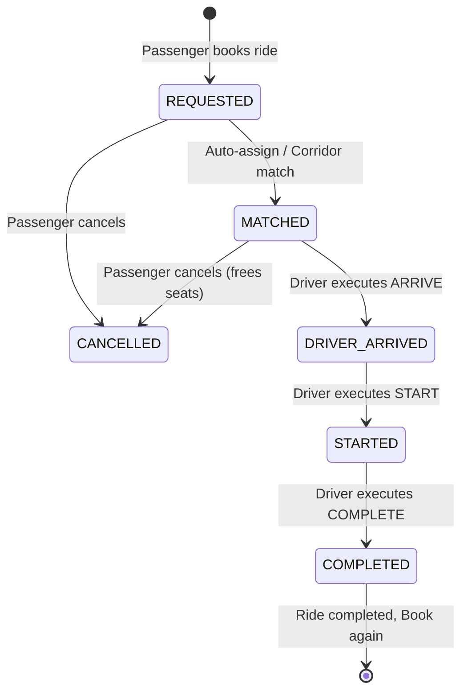

# 🚖 Dhaka Tesla Pool
> *Share a seat. Split the fare. Survive Dhaka traffic.*

[](LICENSE)
[](https://nestjs.com/)
[](https://nextjs.org/)
[](https://www.postgresql.org/)
[](https://www.prisma.io/)
[](https://jestjs.io/)

---

## 📖 1. Problem Statement & The Story of Bullet

**8:41 AM, Banani Road 11.**  
Jashim is leaning against **Bullet**, his three-seat, battery-powered, entirely unaffiliated “Tesla.”
* **Nusrat**, already running late for an office sync, books a ride to **Gulshan 1**.
* Two minutes later, a stranger named **Rafiq** books the same corridor toward **Gulshan 1** or **Mohakhali**.
* The pooling engine calculates in sub-second time whether these passengers share a compatible corridor, splits the fare fairly using an integer-poysha formula with a 25% discount, and allocates the seats atomically without race conditions.
* Meanwhile, another driver, **Kabir**, pilots **Thunder** (another 3-seat EV) along the **West-North (Mirpur)** corridor. If a passenger chooses Kabir or requests an incompatible route (e.g. Banani → Mirpur), the system intelligently segregates the pools to avoid conflicting drop-offs.
* Each passenger receives an isolated receipt—never seeing another passenger's personal data or fare breakdown.
* Jashim and Kabir maintain complete authority over their trip lifecycles: **ARRIVE** at pickup $\rightarrow$ **START** trip $\rightarrow$ **COMPLETE** offload.

---

## 🏗️ 2. System Architecture & High-Level Design



---

## 🗄️ 3. Entity-Relationship Data Model (ERD)



---

## ⚡ 4. Core Engineering Principles

### A. Atomic Concurrency Lock & Race Condition Protection
When multiple passengers attempt to reserve the final remaining seat at the exact same millisecond:
1. **Interactive Database Transaction (`prisma.$transaction`)**: The matching engine re-queries the pool with fresh transactional isolation.
2. **Strict Invariant Guard**: Checks if `freshPool.occupiedSeats + request.seatsRequested <= freshPool.capacity`.
3. If capacity is exceeded, the transaction rolls back cleanly, preventing overbooking.
4. Concurrency test suite (`pool-concurrency.spec.ts`) simulates 3 concurrent requests competing for the last 2 seats and confirms zero seat leaks or race conditions.

### B. Integer Poysha Currency (Zero Floating-Point Error)
* All fares are calculated and stored in **Poysha** ($1\text{ BDT} = 100\text{ poysha}$).
* Base fare: `5,000 poysha` (50.00 BDT).
* Per-km rate: `2,000 poysha/km` (20.00 BDT/km).
* Discount: Exactly `25%` pooled discount rounded via `Math.round()` on integer poysha.
* Prevents financial drift, floating-point IEEE-754 inaccuracies (`0.1 + 0.2 != 0.3`), and banking rounding discrepancies.

### C. Dhaka Corridor Segregation & Matching Rules
* **7 Dhaka Zones**: Banani, Gulshan 1, Gulshan 2, Mohakhali, Farmgate, Dhanmondi, Mirpur, Uttara.
* **Corridor Heuristic**:
  * `CENTRAL_CONNECT` (Banani $\leftrightarrow$ Mohakhali / Gulshan 1)
  * `CENTRAL_NORTH` (Banani $\leftrightarrow$ Gulshan 2)
  * `NORTH_SUBURB` (Banani $\leftrightarrow$ Uttara)
  * `WEST_NORTH` (Banani $\leftrightarrow$ Mirpur)
  * `WEST_SOUTH` (Banani $\leftrightarrow$ Dhanmondi)
* Divergent corridors (e.g. `Banani -> Mirpur` vs. `Banani -> Uttara`) are strictly segregated into separate pools to guarantee passengers are not sent in opposite directions.

### D. Complete Trip Lifecycle State Machine


### E. Individual Fare Privacy & Security
* Passengers can **only view their own financial receipts** and trip status via `/ride-requests/:id`.
* Accessing another passenger's ride receipt throws an immediate `403 Forbidden` response.

---

## 🌿 5. Git Workflow & Branching Strategy

This project adheres strictly to the professional Git assessment lifecycle:

| Branch | Role / Description |
| :--- | :--- |
| `master` | Primary production-ready codebase containing merged and validated feature increments. |
| `pre-release` | Cut from `master` for integration fixes, environment sanity checks, multi-container Docker configs, and documentation. |
| `release/v1.0.0` | Cut from `pre-release` as the official delivery version demonstrated in videos and deployment evaluations. |
| `feature/*` | Isolated feature branches merged into `master` after unit and integration verification. |

### Feature Branches Included in Repository History:
* `feature/backend-scaffold-and-db`: NestJS architecture, PostgreSQL Prisma ORM, and seed data.
* `feature/swagger-and-api-docs`: Swagger OpenAPI documentation and global validation pipes.
* `feature/fare-calculator-and-zones`: Integer Poysha calculator and 7 Dhaka zone corridors.
* `feature/auth-and-roles`: JWT authentication, story demo login, and RoleGuard.
* `feature/vehicle-and-manifest`: Dynamic multi-vehicle capacity tracking and live manifest.
* `feature/ride-request-and-pool-engine`: Corridor matching heuristics and atomic capacity locking.
* `feature/concurrency-and-lifecycle-tests`: Concurrency race-condition tests and lifecycle verification.
* `feature/frontend-ui`: Next.js 16 frontend with interactive passenger & driver consoles.
* `feature/concurrency-isolation-and-fleet-selection`: Multi-driver fleet selection and dynamic per-vehicle capacity.

---

## 🚀 6. Setup & Execution Guide

### Option 1: Docker Compose (Quickest Full-Stack Launch)

```bash
# Clone the repository
git clone https://github.com/sabbirhosen44/Dhaka-Tesla-Pool.git
cd Dhaka-Tesla-Pool

# Start all services (Database, NestJS Backend, Next.js Frontend)
docker compose up -d --build
```
* **Frontend:** [http://localhost:3000](http://localhost:3000)
* **Backend API:** [http://localhost:4000/api](http://localhost:4000/api)
* **Swagger API Documentation:** [http://localhost:4000/api/docs](http://localhost:4000/api/docs)

---

### Option 2: Local Development Setup

#### 1. Database (PostgreSQL)
```bash
docker compose up postgres -d
```

#### 2. Backend (NestJS)
```bash
cd backend
npm install
npx prisma db push
npx prisma db seed
npm run start:dev
```

#### 3. Frontend (Next.js)
```bash
cd frontend
npm install
npm run dev
```

---

## 🧪 7. Test Suite Coverage

Run the backend automated test suite:
```bash
cd backend
npm test
```

### Verified Test Suites (8/8 Passed, 18/18 Tests):
* `app.controller.spec.ts` — API health check and uptime.
* `vehicle.service.spec.ts` — Dynamic capacity calculation for any 3-seat EV and status toggle.
* `pool-engine.service.spec.ts` — Corridor matching heuristics and pool creation.
* `fare-calculator.service.spec.ts` — Integer poysha math, 25% discount, and distance rates.
* `fare-calculator.controller.spec.ts` — HTTP fare quotation endpoints.
* `pool-concurrency.spec.ts` — Atomic transaction isolation against race conditions.
* `ride-request.service.spec.ts` — Privacy isolation and unauthorized access prevention.
* `auth.service.spec.ts` — Demo actor login and JWT issuance.

---

## 🎬 8. Story Demo Actors

Use the built-in profile selector on the frontend to switch personas instantly:

| Actor | Role | Vehicle / Function |
| :--- | :--- | :--- |
| **Jashim** | Driver | Drives **Bullet** (Tesla Model 3, 3 seats) |
| **Kabir** | Driver | Drives **Thunder** (Tesla Model Y, 3 seats) |
| **Nusrat** | Passenger | Books early morning ride to Mohakhali / Gulshan 1 |
| **Rafiq** | Passenger | Books same corridor (Gulshan 1), sharing Bullet with Nusrat |
| **Shirin** | Passenger | Tests capacity boundaries or chooses Kabir to Mirpur |
| **Tanvir** | Passenger | Multi-seat bookings (1 to 3 seats) |
| **Anika** | Passenger | General corridor passenger |

---

## 📄 9. License
Distributed under the MIT License. Developed for the Dhaka Tesla Pool Assessment.
